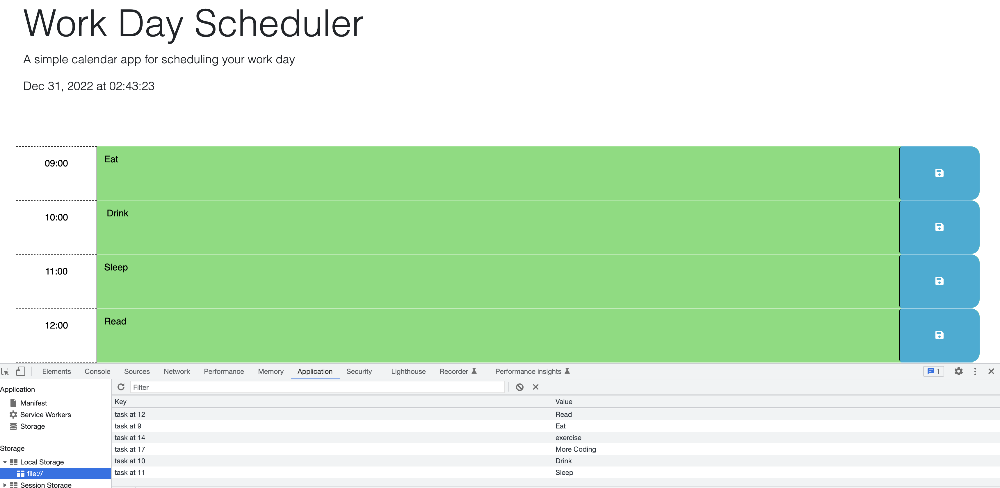

# Joycell's Work Day Scheduler

## Description

 Happy New Year! If your New Year's Resolution is to get better at time management, then this Work Day Scheduler is just what you need to get into the habit of time-blocking.  
 Simply add your to-do items to each hourly block and click save. Your saved tasks will remain there even after refreshing. 
 The tasks will also save in your local storage so you don't have to worry about losing anything. 
 It is also color-coded so you will receive real-time updates on past, present, and future tasks as the hour approaches. 

## Installation

 Right click on index.html 
 Select "Open In Default Browser" 
 Once it populates, you are free to create your very own schedule. 
 You can also to go the DevTools section and check the console.log action. 
 Don't forget to check the Applications tab in DevTools to view your saved tasks. 

## Usage

 This code can be used for ideas on how to create a scheduler for a typical 8-hour work day, but if there are any suggestions, feel free to let me know. 
 You can also view this in published form at the following link: https://joy-johns.github.io/Work_Day_Scheduler/ 
 Please see the attachment for a picture of the Work Day Scheduler 

## Credits

Thank you to the MSU Staff for the instruction provided to produce this webpage.

## License

No license, This is for everyone to use as this is for academic purposes.
